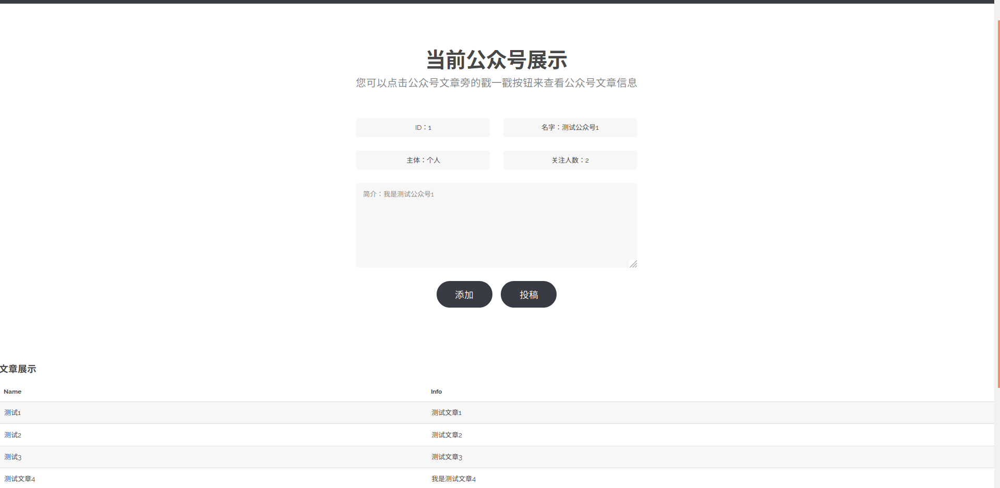

# Django-for-address
Django+HTML+CSS+SQL

## 开发配置
+ Python3.6
+ Ubuntu18.06
+ Django2.1
+ Mysql

## 页面展示

### 主页面

### 好友展示页面

### 个人名片展示页面

### 好友名片展示页面

### 群聊展示页面

### 公众号展示页面

## 数据库导入方法
1. 首先建空数据库 mysql>create database dbname;
2. 导入数据库
    + 方法一：
        1. 选择数据库 mysql>use dbname ;
        2. 设置数据库编码 mysql>set names utf8;
        3. 导入数据（注意sql文件的路径）mysql>source /home/xxxx/dbname.sql;
    + 方法二：直接使用 mysql -u用户名 -p密码 数据库名 < 数据库名.sql

## 系统ER图

